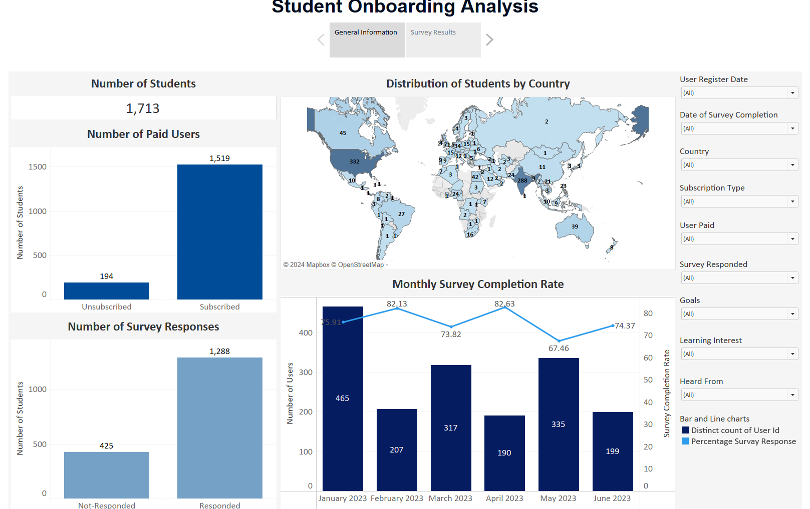
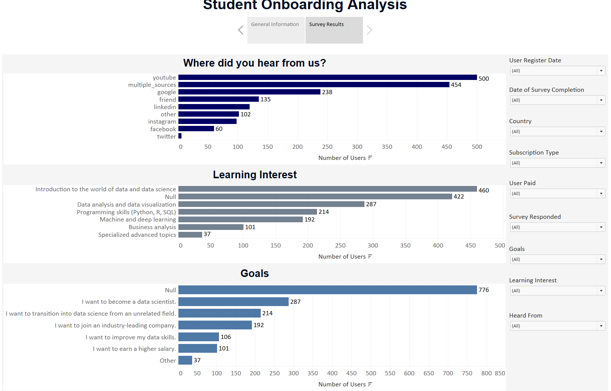

# Student Onboarding Analysis in Tableau

## Project Overview
This project analyzes the onboarding experience of students on an e-learning platform using Tableau. By examining survey data, the goal is to understand how students discover the platform, their learning aspirations, and career goals. An interactive dashboard was developed to visualize trends and provide actionable insights.

## Objective
The objective was to create a Tableau dashboard to:
- Visualize survey response and completion rates across countries and time.
- Identify primary acquisition channels, learning interests, and student goals.
- Enable stakeholders to dynamically analyze data through interactive filters based on registration date, country, subscription type, and survey status.

## Problem Statement
The e-learning platform lacked clarity about:
- Survey completion trends over time and across countries.
- The most effective channels for student acquisition.
- Students' primary learning interests and career goals.
Understanding these aspects was crucial to optimizing the onboarding process and tailoring platform strategies to user needs.

## What Was Done
### Data Preparation
- Worked with preprocessed survey data from January to June 2023.
- Dealt with missing values and encoded variables numerically.

### Dashboard Development
1. **General Information Tab**:
   - **Number of Students**: Displayed total students, paid users, and survey respondents.
   - **Distribution by Country**: Mapped student numbers and survey completion rates across countries.
   - **Monthly Survey Completion Rate**: Highlighted trends in responses over time.

     
   *Figure: Dashboard General Information*

2. **Survey Results Tab**:
   - **Acquisition Channels**: Visualized where students heard about the platform (e.g., YouTube, Google, LinkedIn).
   - **Learning Interests**: Analyzed the most desired learning areas, focusing on beginner-level topics.
   - **Student Goals**: Identified common goals like becoming a data scientist or improving data skills.

     
   *Figure: Dashboard Survey Results*

### Dashboard Features
- Added interactive filters for date, country, subscription type, and survey status.
- Ensured a user-friendly experience for slicing and dicing data dynamically.

## Key Insights
- **Survey Completion Rate**: With a 75.19% completion rate, the survey results are representative of the population.
- **Top Countries**: USA, India, and UK had the highest survey participation, with nearly 100% response rates.
- **Acquisition Channel**: YouTube was the most effective channel, attracting 500 students.
- **Student Profile**: Most students are beginners, focusing on introductory topics like Python, SQL, and data visualization.

## Recommendations
1. **Increase Survey Completion**:
   - Implement rewards like XP points for users who complete surveys.
2. **Attract More Beginners**:
   - Upload introductory videos on YouTube to target potential learners.
3. **Enhance Engagement**:
   - Tailor platform content to align with beginner-level interests and goals.

## Conclusion
This project provided actionable insights into student onboarding, enabling the platform to optimize its acquisition strategies, refine onboarding processes, and better align with student needs. The dashboard serves as a dynamic tool for ongoing analysis and decision-making.
